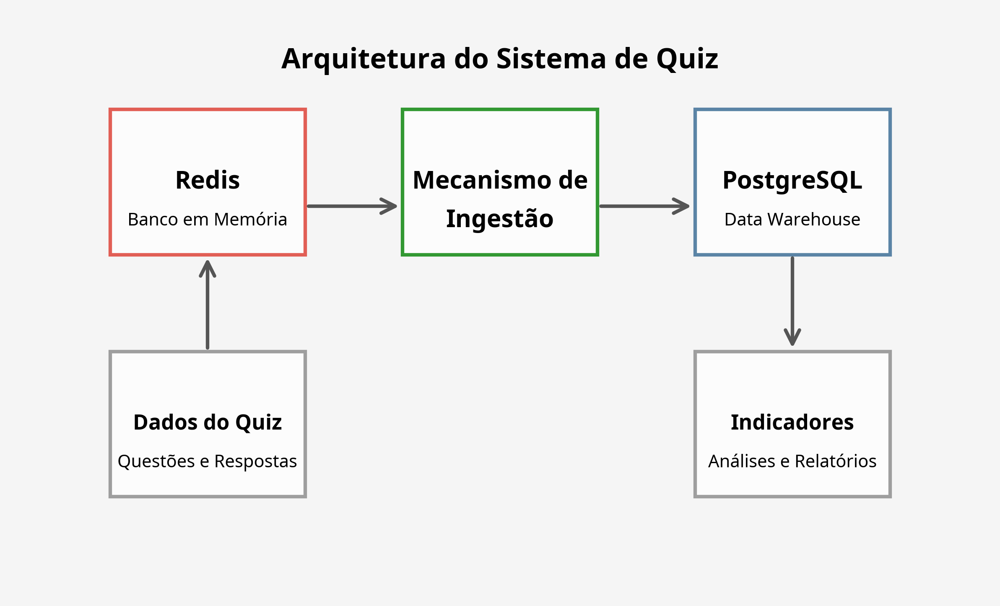

# Documentação do Projeto de Ingestão e Armazenamento de Dados do QUIZ

## 1. Introdução

Este documento apresenta o projeto de ingestão e armazenamento de dados para um sistema de Quiz, utilizando Redis como banco intermediário e PostgreSQL como Data Warehouse (DW). O projeto foi desenvolvido como trabalho final da disciplina In Memory DB do MBA.

O objetivo principal é implementar um mecanismo eficiente de ingestão de dados que permita a transferência de informações do Redis para o PostgreSQL, com foco na estruturação dos dados e geração de indicadores relevantes para análise de desempenho dos usuários e qualidade das questões.

## 2. Arquitetura do Sistema

A arquitetura do sistema é composta por três componentes principais:

1. **Redis (Banco de Dados em Memória)**: Armazena os dados operacionais do Quiz, incluindo questões e respostas dos usuários.
2. **Mecanismo de Ingestão**: Transfere os dados do Redis para o PostgreSQL de forma contínua e confiável.
3. **PostgreSQL (Data Warehouse)**: Armazena os dados em um formato estruturado para análise e geração de indicadores.



## 3. Modelagem de Dados no Redis

### 3.1 Estruturas de Dados Utilizadas

Para o sistema de Quiz, utilizamos principalmente **Hashes** (tabelas hash) no Redis, que permitem armazenar campos e valores associados a uma chave.

### 3.2 Entidades Principais

#### 3.2.1 Questões (Questions)

As questões são armazenadas como hashes no Redis, com a seguinte estrutura:

**Chave**: `question:{question_id}`

**Campos**:
- `question_text`: Texto da pergunta
- `alternativa_a`: Texto da alternativa A
- `alternativa_b`: Texto da alternativa B
- `alternativa_c`: Texto da alternativa C
- `alternativa_d`: Texto da alternativa D
- `alternativa_correta`: Alternativa correta (a, b, c ou d)
- `dificuldade`: Nível de dificuldade da questão (fácil, médio, difícil)
- `assunto`: Assunto ou categoria da questão

**Exemplo**:
```
HSET question:1 question_text "Qual é a resposta de tudo?" alternativa_a "1" alternativa_b "23" alternativa_c "42" alternativa_d "11" alternativa_correta "c" dificuldade "fácil" assunto "geek"
```

#### 3.2.2 Respostas (Answers)

As respostas dos usuários são armazenadas como hashes no Redis, com a seguinte estrutura:

**Chave**: `answer:{usuario}:{question_id}:{nro_tentativa}`

**Campos**:
- `question_id`: ID da questão respondida
- `alternativa_escolhida`: Alternativa escolhida pelo usuário (a, b, c ou d)
- `datahora`: Data e hora em que a resposta foi registrada
- `usuario`: Nome do usuário que respondeu
- `nro_tentativa`: Número da tentativa do usuário para esta questão

**Exemplo**:
```
HSET answer:dlemes:1:1 question_id 1 alternativa_escolhida "c" datahora "19/05/2025 09:47" usuario "dlemes" nro_tentativa 1
```

### 3.3 Estruturas Auxiliares

#### 3.3.1 Índices para Consultas Rápidas

Para facilitar consultas específicas, utilizamos conjuntos (Sets) como índices:

**Questões por Assunto**:
- Chave: `index:assunto:{nome_do_assunto}`
- Valores: IDs das questões relacionadas ao assunto

**Questões por Dificuldade**:
- Chave: `index:dificuldade:{nivel_dificuldade}`
- Valores: IDs das questões com o nível de dificuldade especificado

#### 3.3.2 Contadores

Para facilitar a geração de IDs únicos e estatísticas:

**Contador de Questões**:
- Chave: `counter:question`
- Valor: Número total de questões cadastradas

**Contador de Respostas por Usuário**:
- Chave: `counter:answers:{usuario}`
- Valor: Número total de respostas do usuário

### 3.4 Justificativa das Escolhas

A escolha de hashes para representar as entidades principais se deve à eficiência de armazenamento, possibilidade de operações atômicas, recuperação parcial de dados e organização lógica das entidades.

A estrutura de chaves foi projetada para facilitar buscas, evitar colisões e suportar padrões de busca para recuperação de grupos de dados relacionados.

Os índices auxiliares e contadores foram incluídos para melhorar a performance de consultas, facilitar a geração de relatórios e estatísticas, e suportar consultas complexas.

## 4. Exemplos de Carga de Dados

### 4.1 Script de Carga

Foi desenvolvido um script Python para carregar dados simulados no Redis, seguindo a modelagem definida. O script realiza as seguintes operações:

1. Estabelece conexão com o Redis
2. Limpa dados existentes (se necessário)
3. Carrega questões simuladas
4. Carrega respostas simuladas
5. Atualiza índices e contadores

O script também salva os dados simulados em arquivos JSON para referência futura.

### 4.2 Dados Simulados

Foram criados dados simulados para questões e respostas, abrangendo diferentes assuntos, níveis de dificuldade e padrões de resposta dos usuários.

**Exemplo de Questão Simulada**:
```json
{
  "question_id": 1,
  "question_text": "Qual é a principal vantagem do Redis como banco de dados em memória?",
  "alternativa_a": "Armazenamento em disco",
  "alternativa_b": "Alta velocidade de acesso",
  "alternativa_c": "Suporte nativo a SQL",
  "alternativa_d": "Baixo consumo de memória",
  "alternativa_correta": "b",
  "dificuldade": "fácil",
  "assunto": "banco de dados"
}
```

**Exemplo de Resposta Simulada**:
```json
{
  "question_id": 1,
  "alternativa_escolhida": "b",
  "datahora": "22/05/2025 10:15",
  "usuario": "maria",
  "nro_tentativa": 1
}
```

## 5. Mecanismo de Ingestão

### 5.1 Arquitetura do Mecanismo

O mecanismo de ingestão foi implementado como um script Python que realiza as seguintes operações:

1. Conecta-se ao Redis e ao PostgreSQL
2. Cria as tabelas necessárias no PostgreSQL (se não existirem)
3. Processa questões do Redis e insere no PostgreSQL
4. Processa respostas do Redis e insere no PostgreSQL
5. Registra logs de ingestão para rastreabilidade
6. Executa em loop contínuo, verificando novas entradas a cada intervalo definido

### 5.2 Modelagem no PostgreSQL

A modelagem no PostgreSQL segue o padrão de Data Warehouse, com tabelas de dimensão e fato:

**Tabelas de Dimensão**:
- `dim_assunto`: Armazena os assuntos das questões
- `dim_dificuldade`: Armazena os níveis de dificuldade
- `dim_usuario`: Armazena os usuários que responderam às questões

**Tabelas de Fato**:
- `fato_questao`: Armazena as questões com referências às dimensões
- `fato_resposta`: Armazena as respostas dos usuários com referências às questões e usuários

**Tabela de Log**:
- `log_ingestao`: Registra o processo de ingestão para rastreabilidade

### 5.3 Processo de Ingestão

O processo de ingestão segue estas etapas para cada entidade:

1. Recupera as chaves do Redis para a entidade
2. Verifica se o registro já existe no PostgreSQL
3. Obtém ou cria registros nas tabelas de dimensão relacionadas
4. Insere o registro na tabela de fato correspondente
5. Registra o resultado da operação na tabela de log

O mecanismo também implementa tratamento de erros e transações para garantir a consistência dos dados.

## 6. Consultas SQL para Indicadores

Foram desenvolvidas consultas SQL para gerar indicadores relevantes para análise do sistema de Quiz:

### 6.1 Taxa de Acerto por Questão

```sql
SELECT 
    q.question_id,
    q.question_text,
    a.nome AS assunto,
    d.nivel AS dificuldade,
    COUNT(r.id) AS total_respostas,
    SUM(CASE WHEN r.is_correct THEN 1 ELSE 0 END) AS total_acertos,
    ROUND((SUM(CASE WHEN r.is_correct THEN 1 ELSE 0 END)::FLOAT / COUNT(r.id)) * 100, 2) AS taxa_acerto
FROM 
    fato_questao q
    JOIN dim_assunto a ON q.id_assunto = a.id
    JOIN dim_dificuldade d ON q.id_dificuldade = d.id
    LEFT JOIN fato_resposta r ON q.question_id = r.id_questao
GROUP BY 
    q.question_id, q.question_text, a.nome, d.nivel
ORDER BY 
    taxa_acerto DESC;
```

### 6.2 Desempenho por Usuário

```sql
SELECT 
    u.nome AS usuario,
    COUNT(r.id) AS total_respostas,
    SUM(CASE WHEN r.is_correct THEN 1 ELSE 0 END) AS total_acertos,
    ROUND((SUM(CASE WHEN r.is_correct THEN 1 ELSE 0 END)::FLOAT / COUNT(r.id)) * 100, 2) AS taxa_acerto
FROM 
    fato_resposta r
    JOIN dim_usuario u ON r.id_usuario = u.id
GROUP BY 
    u.nome
ORDER BY 
    taxa_acerto DESC;
```

### 6.3 Dificuldade Real vs. Dificuldade Cadastrada

```sql
SELECT 
    q.question_id,
    q.question_text,
    d.nivel AS dificuldade_cadastrada,
    COUNT(r.id) AS total_respostas,
    ROUND((SUM(CASE WHEN r.is_correct THEN 1 ELSE 0 END)::FLOAT / COUNT(r.id)) * 100, 2) AS taxa_acerto,
    CASE 
        WHEN (SUM(CASE WHEN r.is_correct THEN 1 ELSE 0 END)::FLOAT / COUNT(r.id)) * 100 < 40 THEN 'difícil'
        WHEN (SUM(CASE WHEN r.is_correct THEN 1 ELSE 0 END)::FLOAT / COUNT(r.id)) * 100 < 70 THEN 'médio'
        ELSE 'fácil'
    END AS dificuldade_real
FROM 
    fato_questao q
    JOIN dim_dificuldade d ON q.id_dificuldade = d.id
    LEFT JOIN fato_resposta r ON q.question_id = r.id_questao
GROUP BY 
    q.question_id, q.question_text, d.nivel
HAVING 
    COUNT(r.id) > 0
ORDER BY 
    taxa_acerto;
```

### 6.4 Distribuição de Respostas por Alternativa

```sql
SELECT 
    q.question_id,
    q.question_text,
    COUNT(r.id) AS total_respostas,
    SUM(CASE WHEN r.alternativa_escolhida = 'a' THEN 1 ELSE 0 END) AS alternativa_a,
    SUM(CASE WHEN r.alternativa_escolhida = 'b' THEN 1 ELSE 0 END) AS alternativa_b,
    SUM(CASE WHEN r.alternativa_escolhida = 'c' THEN 1 ELSE 0 END) AS alternativa_c,
    SUM(CASE WHEN r.alternativa_escolhida = 'd' THEN 1 ELSE 0 END) AS alternativa_d,
    ROUND((SUM(CASE WHEN r.alternativa_escolhida = 'a' THEN 1 ELSE 0 END)::FLOAT / COUNT(r.id)) * 100, 2) AS pct_a,
    ROUND((SUM(CASE WHEN r.alternativa_escolhida = 'b' THEN 1 ELSE 0 END)::FLOAT / COUNT(r.id)) * 100, 2) AS pct_b,
    ROUND((SUM(CASE WHEN r.alternativa_escolhida = 'c' THEN 1 ELSE 0 END)::FLOAT / COUNT(r.id)) * 100, 2) AS pct_c,
    ROUND((SUM(CASE WHEN r.alternativa_escolhida = 'd' THEN 1 ELSE 0 END)::FLOAT / COUNT(r.id)) * 100, 2) AS pct_d,
    q.alternativa_correta
FROM 
    fato_questao q
    LEFT JOIN fato_resposta r ON q.question_id = r.id_questao
GROUP BY 
    q.question_id, q.question_text, q.alternativa_correta
HAVING 
    COUNT(r.id) > 0
ORDER BY 
    q.question_id;
```

### 6.5 Progresso por Assunto

```sql
SELECT 
    a.nome AS assunto,
    u.nome AS usuario,
    COUNT(r.id) AS total_respostas,
    SUM(CASE WHEN r.is_correct THEN 1 ELSE 0 END) AS total_acertos,
    ROUND((SUM(CASE WHEN r.is_correct THEN 1 ELSE 0 END)::FLOAT / COUNT(r.id)) * 100, 2) AS taxa_acerto
FROM 
    fato_resposta r
    JOIN fato_questao q ON r.id_questao = q.question_id
    JOIN dim_assunto a ON q.id_assunto = a.id
    JOIN dim_usuario u ON r.id_usuario = u.id
GROUP BY 
    a.nome, u.nome
ORDER BY 
    a.nome, taxa_acerto DESC;
```

## 7. Implementação e Testes

### 7.1 Ambiente de Desenvolvimento

O projeto foi implementado em um ambiente Linux com as seguintes tecnologias:

- Redis 6.0.16
- PostgreSQL 14
- Python 3.11
- Bibliotecas Python: redis, psycopg2, json, datetime

### 7.2 Testes Realizados

Foram realizados os seguintes testes para validar o projeto:

1. **Teste de Carga no Redis**: Verificação da inserção correta de questões e respostas no Redis.
2. **Teste de Ingestão**: Verificação da transferência correta dos dados do Redis para o PostgreSQL.
3. **Teste de Consultas**: Validação das consultas SQL para geração de indicadores.

### 7.3 Resultados dos Testes

Os testes foram bem-sucedidos, com os seguintes resultados:

- **Carga no Redis**: Foram carregadas 5 questões e 13 respostas simuladas.
- **Ingestão para PostgreSQL**: Todos os dados foram transferidos corretamente, com registros de log para rastreabilidade.
- **Consultas SQL**: As consultas geraram os indicadores esperados, permitindo análises detalhadas do desempenho dos usuários e da qualidade das questões.

## 8. Conclusão

O projeto implementou com sucesso um mecanismo de ingestão de dados para um sistema de Quiz, utilizando Redis como banco intermediário e PostgreSQL como Data Warehouse. A solução permite a transferência eficiente de dados entre os sistemas, com estruturação adequada para análise e geração de indicadores relevantes.

Os principais objetivos alcançados foram:

1. Modelagem eficiente das entidades no Redis
2. Implementação de scripts de carga para dados simulados
3. Desenvolvimento de um mecanismo robusto de ingestão
4. Modelagem adequada no PostgreSQL para análise de dados
5. Criação de consultas SQL para geração de indicadores

O sistema está pronto para ser utilizado em um ambiente de produção, com capacidade para processar grandes volumes de dados e gerar insights valiosos sobre o desempenho dos usuários e a qualidade das questões do Quiz.

## 9. Referências

- [Redis Documentation](https://redis.io/documentation)
- [PostgreSQL Documentation](https://www.postgresql.org/docs/)
- [Python Documentation](https://docs.python.org/3/)
- [Redis to PostgreSQL Repository](https://github.com/commithouse/redis-to-postgres)
- [API Question Redis Repository](https://github.com/commithouse/apiQuestionRedis)
